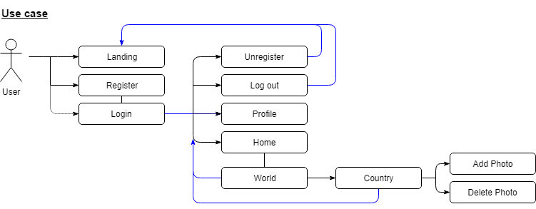
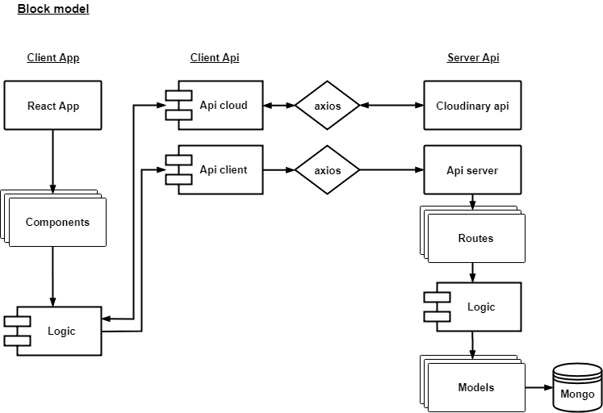
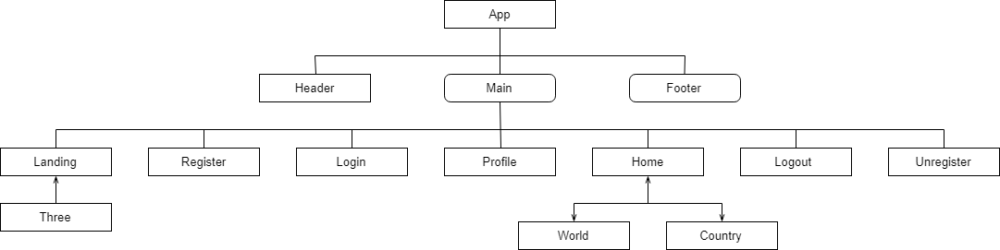
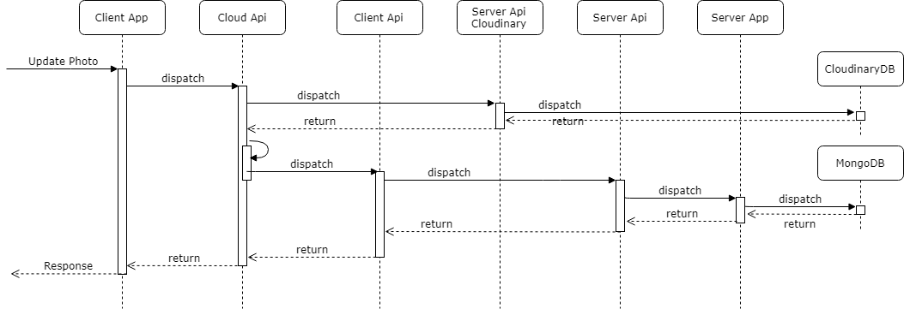
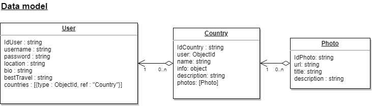

# 🌍 WorldPic 1.1.0 📷
________

**WorldPic is an app for saving pictures located in a world map, showing which countries have been visited.**

*On version 2.0.0 WorldPic is going to be used as a social network, allowing find and follow other users, write recommendations, experiences and rate the travels. This may help other travelers to find a possible destination for the next travel.*
<br/>
## Functional description

<br/>



<br/>

When user uses the app, first arrives to **landing**, there is a little summaries about the app and a 3D interactable logo.

In this point user needs to **login**, for that, it's needed to be **registered**.

Once logged, header changes, show other routes and user arrives to **profile** to see the own user's info. Also it's possible to go to **log out** or **unregister** (redirects to landing).

In this header it's possible also going to home where is shown a **world** map, where not visited countries are light colored and visited orange. To see one **country** and **upload** or **delete** pictures, fact that marks a country as visited or not, it's needed to click a country in the world map.

<br/>

## Technical description


This app has more heavier private components as 3D or pictures than public, therefore it is rendered in client side, also has calls to a couple server-side APIs and their own servers and databases.

Uses html, css3, Javascript, React, Express, Node, Mongoose and Mongo, also uses libraries as axios, three.js, react-simple-maps, jsonwebtoken, expect or chai.

<br/>



<br/>

###### Client side

First of all we found an APP, done with React and his components, one of those, Three, uses a three.js library to animate WorldPic letters and a airplane did with Blender. Animations are done in the component itself; rotating the letters is generated with the mouse movement in x axis, moving the camera up and dowm (looking at the 3D logo) with the mouse movement in y axis and finally "running" the airplane scrolling down. 

Another component, World, uses react-simple-maps to show the interactable world map, some logic of views, countries visited, painting and more are done in the component. This component and the most of the others, are using bussiness logic from client side.

<br/>



<br/>

On this logic there are the methods that calls the APIs in client side, one of those is for the own server api and the other uses cloudinary api. Sends the data with extra properties like token or user id, and receives the response that will manage React components to show to the user in form of message, error, redirecting, painting on the map...

>Logic client side example
>
> *User uploads a picture with the add photo form, the form calls a inner component function that calls the logic. This logic, has a function that first sends the picture to cloudinary througth api cloud logic, when succesful response arrives, sends the information to api client to enter it to the database. If everything succeed, uploaded image is going to be rendered.*

<br/>



<br/>

Client Api manager or travelApi, manages with axios requests and responses to the api server, using promises to check if response is succeded or rejected, this is done first of all checking the response status. 

Cloud Api manages the shiping of pictures, sending the data with axios, uploads the picture to the cloud, also receives or delete those with cloudinary library.

###### Server side

Data arrives to Api server side, which using express, manages server and define the routes. Before sending the request to the server App, validates the token and parse the body to a json format. Depending of the response catching errors or getting succesful responses, it will create a status (200+ or 400+) and will send all of this to the client side.

Bussiness logic in server side has the role of sending information and manage the database thought data models, if adding or getting data, some error is ocurred is the one that "says" what happened.

<br/>



<br/>

## Mounting Workspace

For download and work on your local machine with this project follow the next steps.

##### Prerequisites

Install Node and MongoDB in your machine.

##### Installing

Copy or download this [repo](https://github.com/MinaZhen/worldPic.git)

Open your command line and enter the directory where you want to copy the repository and then enter:

```sh
git clone https://github.com/MinaZhen/worldPic.git
```

```
.
├── client
|     ├── api
|     |     └── ...
|     ├── apiCloud
|     |     └── ...
|     └── app
|           └── ...
├── docs
      └── ...
└── server
      ├── api*
      |     └── ...
      ├── data*
      |     └── ...
      └── logic*
            └── ...
```

Navigate into worldPic, go and run npm install in each marked* folder.

```
cd server/data
npm install

cd ../logic
npm install

···
```

Once this is done, you can work it!

## Version

WorldPic1.1.0 

#### Next releases 

- 1.2.0 - Update user info.
- 1.3.0 - Improving private app.
- 2.0.0 - Find users.

## Author

- Marina Clarés - *web and videogames developer* - [GitHub](https://github.com/MinaZhen)

Project for: 

